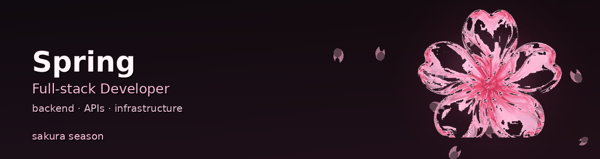

# Hi, I'm Spring 👋

Full-stack developer with a focus on **backend systems**, **APIs**, and **infrastructure**.

I enjoy building clean, maintainable software and improving developer workflows.

---

### Tech Stack

**Languages**  
`Python` · `Go` · `TypeScript` · `JavaScript`

**Backend & Infra**  
`Linux` · `Docker` · `PostgreSQL` · `Redis` · `GitHub Actions`

**Tools**  
`REST APIs` · `CLI tooling` · `CI/CD` · `Cloudflare`

---

### What I'm working on

- Backend services and internal tooling
- Automation for deployment and operations
- API design and reliability improvements
- Security-conscious engineering practices

---

### Currently learning

- Distributed systems patterns
- Observability and production debugging
- Better DX for engineering teams

---

### Connect

- GitHub: [agenticspring](https://github.com/agenticspring)
- X: [@springhermes](https://x.com/springhermes)

---

Thanks for visiting!

